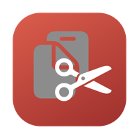
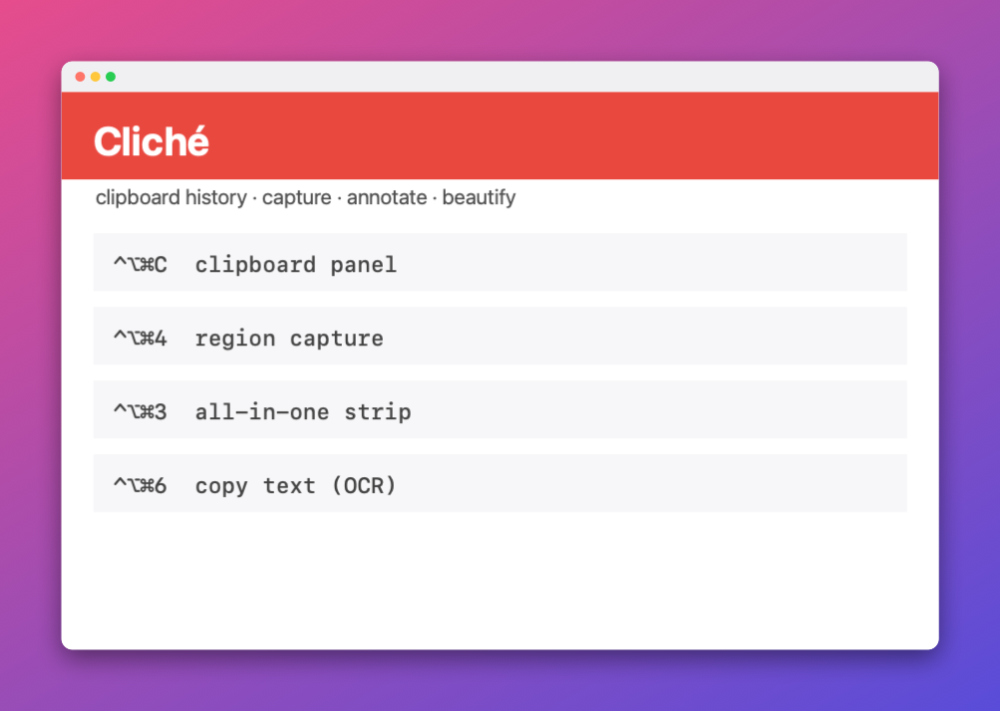

<p align="center">
  
</p>

<h1 align="center">Cliché</h1>

<p align="center"><b>The free, open-source Mac menu bar app that combines clipboard history (like Maccy) with screen capture and annotation (like CleanShot X).</b><br>
Pin and search everything you copy · capture, mark up, redact, record, and measure anything on screen.<br>
100% local and private — no accounts, no network, no telemetry. Grab the zip from <a href="https://github.com/curtismu7/cliche/releases/latest">Releases</a>, or build from source.</p>

<p align="center">
  
  <br><sub>This banner was generated by Cliché's own beautify + frame pipeline.</sub>
</p>

---

## Install

**Option 1 — download the app** (no developer tools needed). Grab either file from the [latest release](https://github.com/curtismu7/cliche/releases/latest):

- **`Cliche-x.x.x.zip`** — unzip and double-click **`Install Cliché.command`**; installs to **`~/Applications/Cliche.app`** (your personal Applications folder — no admin password), clears the Gatekeeper flag, and offers launch-at-login. **Recommended.**
- **`Cliche-x.x.x.dmg`** — drag to Applications (system folder). Same app; zip installer is simpler if you don't want `/Applications`.

**Option 2 — Homebrew** (installs to `/Applications/Cliche.app` — pick **either** Homebrew **or** zip/`make install`, not both):

```sh
brew tap curtismu7/cliche
brew install --cask cliche
```

(Homebrew asks you to `brew trust curtismu7/cliche` once — standard for third-party taps.)

**Option 3 — build from source** (macOS 14+, Xcode Command Line Tools):

```sh
git clone https://github.com/curtismu7/cliche.git
cd cliche
make install    # builds, installs to ~/Applications/Cliche.app, launches
```

**Where is the app?** Zip and `make install` → **`~/Applications/Cliche.app`**. Homebrew → `/Applications/Cliche.app`. Only one — duplicates break Screen Recording permission.

**Permissions** (macOS asks once each): *Screen Recording* on your first screenshot, and *Accessibility* only if you use direct paste. Everything else works with no permissions at all.

**Screen Recording keeps opening Settings even though Cliché is toggled ON?** macOS grants permission **per app path and per build signature**. Keep **one** copy at **`~/Applications/Cliche.app`**, run `Scripts/fix-screen-recording.sh`, toggle Cliché **off → on** in System Settings → Privacy & Security → **Screen & System Audio Recording**, then **quit + reopen twice**.

## Menu bar icon

Cliché lives in the **top-right menu bar** — by default **two icons**: 📋 clipboard and 📷 capture (Settings → Icons can merge them into one combined scissors icon). There is no Dock icon.

**Can't see it?** The app may still be running. Use **`⌥1`** for the clipboard list at your cursor, or **`⌥2`** for capture — both work without clicking the icon.

On a **MacBook with a notch**, the black camera housing at the top center eats menu bar space. When you have many icons, extras get pushed **under the notch** and disappear. Fixes:

1. **System Settings → Control Center** — turn off menu bar modules you don't need (Sound, Bluetooth, etc.) to free space.
2. Hold **⌘** and **drag** menu bar icons — move Cliché's icon as far **right** as you can (just left of the system cluster).
3. Check the **»** overflow at the far right — macOS hides extras there when space is tight.
4. **System Settings → Displays** — try **Default** scaling instead of "More Space" (more space shrinks the bar and hides more icons).

If you have two copies (`~/Applications/Cliche.app` and `/Applications/Cliche.app`), delete one and reinstall from the [latest release](https://github.com/curtismu7/cliche/releases/latest).

## Getting started

1. **Open the clipboard list** — press **`⌥1`** (appears at your cursor), or click the 📋 menu bar icon.
2. **Open the capture panel** — click the 📷 menu bar icon, or press **`⌥2`**.
3. **Capture a region** — **`⌃⌥⌘4`**. A thumbnail appears in the **bottom-left corner**; **click it** to open the annotation editor.
4. **Re-annotate a saved capture** — **`⌥2`** → **Captures** tab → hover a screenshot → click **Annotate** (✏️).
5. **Customize shortcuts** — panel footer **gear** → Hotkeys. The **?** button lists every in-panel shortcut.

**Annotation editor shortcuts:** `⌘Z` undo · `⇧⌘C` copy annotated image · `↩` save (overwrites the file; layers stay editable).

## What it does

### 📋 Clipboard history

- Remembers your last **150 text snippets and 50 images** (both configurable in Settings) from anywhere on your Mac; history survives restarts.
- **Fuzzy search** — the panel opens with search focused; `hw` finds "hello world".
- **Keyboard-first** — `↑↓` select, `↩` copies, `⌘1–9` grab the first nine, `⌘⌫` deletes, `⌥P` pins, `⌥U` unpins.
- **Paste directly into the app you were using** — `⌥↩` or ⌥-click types the item where your cursor was.
- **Pin** anything to keep it forever — pins live in their own section at the top, above a "Recent" separator, with an **Unpin All** button; pinned items never count against history limits. Plus **edit text clips in place** and **preview** long text or images in a floating window with copy/pin/edit corners.
- **Images in a horizontal strip**, previewable, pinnable, annotatable.
- **Snippets** — reusable templates with `%DATE%`, `%TIME%`, `%CLIPBOARD%` variables.
- **Privacy built in** — anything copied from password managers (concealed/transient pasteboard types) is never recorded, with a user-editable ignore list.
- **⌥1** — floating clipboard list at your cursor (Maccy-style).
- **⌃⌥⌘C** — same floating list (alternate shortcut; customizable in Settings).
- **Import history from Maccy, Paste, or Clipy** — open Settings → General and click *Import from …* to migrate your existing clipboard history. Duplicates are skipped; nothing is changed in the source app. The button only appears for apps whose storage Cliché detects on your Mac.

### 📷 Screen capture

- **Region capture on a frozen screen** with a magnifier loupe, live pixel-size label, and Shift-to-square — plus window, full-screen, and timed (3/5/10 s) capture.
- **All-in-one capture** — one hotkey (`⌃⌥⌘3`) opens the overlay with a mode strip: Region, Window, Full Screen, or Copy Text, switchable with keys 1–4.
- **Hide desktop clutter** — a Settings toggle excludes desktop icons from captures and recordings; your wallpaper stays.
- **Multi-window capture** — pick several windows and capture just those together, everything else excluded.
- **Combine captures** — stitch screenshots side-by-side, stacked, or in a grid from the Captures tab.
- **Repeat last region** with one hotkey — perfect for iterating on the same area.
- **OCR** — select any region, the text in it lands on your clipboard (on-device Vision).
- **Scrolling capture** — select a region, scroll the content, Cliché stitches one tall image.
- **Screen recording** — region to MP4, with optional GIF export.
- **Pixel ruler** — hover snaps to UI element edges and shows dimensions; drag measures; click copies.
- **Annotation editor** — arrows, lines, boxes, ellipses, freehand, highlighter, text, pixelate, **true blur** (unrecoverable), counter badges, and **one-click auto-redaction** of emails/links/phone numbers/API keys. Saved captures stay **re-editable** — reopen one and your layers are still there.
- **Beautify panel** — make any capture social-ready with a live preview: editable gradient backdrops (colors + angle), padding, rounded corners, shadow, and an optional matte border; **browser/device frames** — Safari-style bar (light/dark) with editable URL, Mac window bar, or phone/tablet bezel; **auto-balance** trims uneven margins; export at exact social sizes (X 1600×900, Square, IG Portrait); save your look as a **named preset**.
- **Quick Access Overlay** — post-capture thumbnail you can drag into Slack/Mail or click to annotate; QR codes in captures get a "copy link" button.
- **Color picker** with hex copy and a WCAG contrast checker; before/after GIFs from any two captures.
- Screenshots land on the **Desktop + clipboard + Captures tab** (format and clipboard behavior configurable).

## Default shortcuts (all customizable in Settings)

| Shortcut | Action |
| --- | --- |
| `⌥1` | Open clipboard list at cursor |
| `⌥2` | Open the capture panel |
| `⌃⌥⌘C` | Open clipboard list at cursor (alternate) |
| `⌃⌥⌘4` | Capture a region |
| `⌃⌥⌘R` | Repeat the last region |
| `⌃⌥⌘5` | Capture a window |
| `⌃⌥⌘6` | Copy text from screen (OCR) |
| `⌃⌥⌘3` | All-in-one capture (mode strip) |

The **?** button in the panel lists every in-panel shortcut; the **gear** opens Settings (menu bar style, history limits, image format, timer, hotkeys, launch at login, ignore rules).

## Automation

Drive Cliché from Raycast, Shortcuts, Alfred, or the terminal via its URL scheme:

| URL | Action |
| --- | --- |
| `cliche://capture` (or `?mode=region`) | Capture a region |
| `cliche://capture?mode=window` | Capture a window |
| `cliche://capture?mode=fullscreen` | Capture the full screen |
| `cliche://capture?mode=allinone` | All-in-one capture overlay |
| `cliche://ocr` | Copy text from screen |
| `cliche://repeat` | Repeat the last region |
| `cliche://panel` | Open the clipboard panel |

Example: `open "cliche://capture?mode=region"`

## Signing

Cliché is ad-hoc signed — there's no Apple Developer certificate behind it, which is why Gatekeeper asks for a right-click → Open on first launch. The installer clears the quarantine flag for you. Build from source and there's no prompt at all.

## Uninstall

Quit Cliché from the panel, then delete `~/Applications/Cliche.app` and `~/Library/Application Support/Cliche/`, and remove it from System Settings → Login Items if enabled.

## Development

- `Sources/ClicheKit` — library: history store, clipboard monitor, screenshot engine, recorder, stitcher, OCR, annotation renderer, beautify pipeline
- `Sources/Cliche` — the menu bar app (AppKit shell + SwiftUI panels)
- `Sources/cliche-selftest` — assertion-based tests: `make test` (Command Line Tools ship no XCTest)
- `make install` — build + reinstall locally · `make dist` — shareable zip · `make release` — tag, push, and publish a GitHub release
- `docs/` — design spec, roadmap, and the feature research that drove the app

## License

[MIT](LICENSE)
